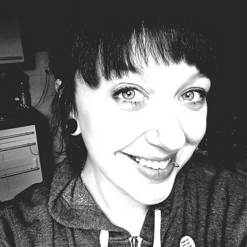

# Power to the people! Rethinking abstractions for a simpler and more empowering web
  
* Names      : Ola Gasidlo and Lena Reinhard
* Twitter   : [@misprintedtype](http://twitter.com/misprintedtype) and [@ffffux](http://twitter.com/ffffux)
* GitHub    : [zoepage](https://github.com/zoepage) and [ffffux](https://github.com/ffffux)
* Working on : and working together on [Hoodie](http://hood.ie)
  
## Abstract
 
The internet has become 25 years old this year. Its creator Tim Berners-Lee stated goal for the web is “This is for everyone”. But can we reach everyone with the technolgy stack we have today? Our systems, architecture and code are still becoming more, more complex and maybe even over-engineered. It is time for us as developers and designers to think in new patterns.
 
We could start by thinking about dreaming instead of just writing code, working on decentralized architectures, and stopping to worry about backends. So let's remember the essence of coding: what is our job? — It is about building applications to be used: used by other developers and, finally, consumers. People whose lives we enrich, whose tasks we simplify by providing what they need to realize their own ideas.
 
To continue to be successful with what we are doing, we need to re-think the entire food chain here: from backend developers, frontend developers and designers to the final application's users. Only by simplifying in all areas and providing better abstractions in all layers of the web development stack, we will be able to create the underpinning of the web that is, truly, “for everyone”.
 
Why does simplicity win? How can backend developers abstract their backends to reduce complexity? How can frontend developers change the way they're developing applications by thinking in new patterns? And, finally: what does all of this have to do with users? Why is it of relevance that we enable users to realize their own ideas? Which approaches in the way we develop applications can help them do so? 
 
This talk will show answers to these questions and more — ideas and solutions for empowering everyone from consumers to developers.
 
## Speaker Bios
  

  
Ola Gasidlo has been working as a professional JavaScript front-end and mobile developer for 7 years now and joined Hoodie by the end of 2013. She organizes OpenTechSchool Dortmund (@ots_do) and gives workshops for kids and grown-ups there, is co-organizer of reject.js – and: she’s the mother of a wonderful daughter. Aside from that, she loves to ride the trails.  
  
Lena Reinhard  is a professional writer and photographer with a long-time experience in Marketing and Communications. Since joining Hoodie over a year ago, she's been focussing on spreading the word about Hoodie and furthering the project's outreach. She's a traveller, surfer, musician and she likes the sea.
